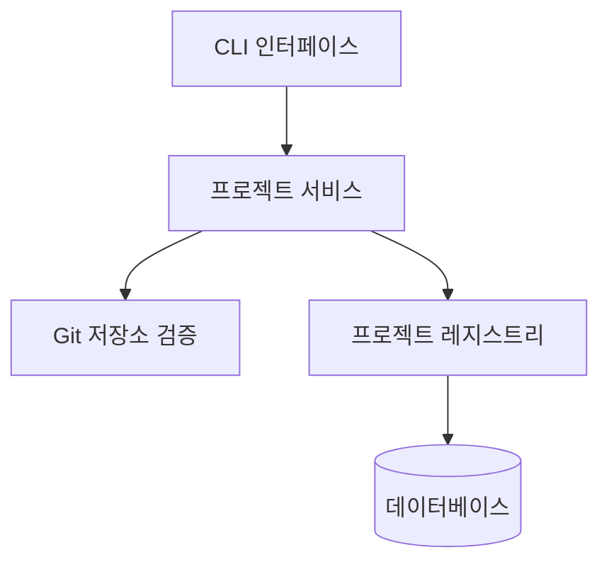
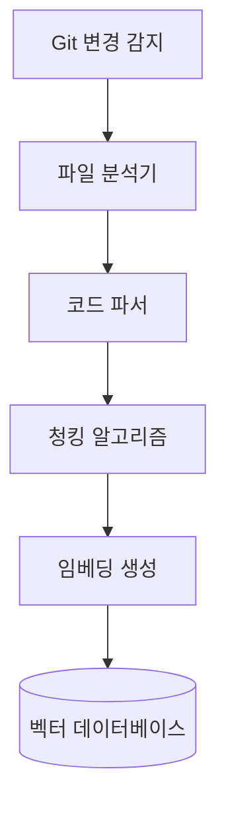
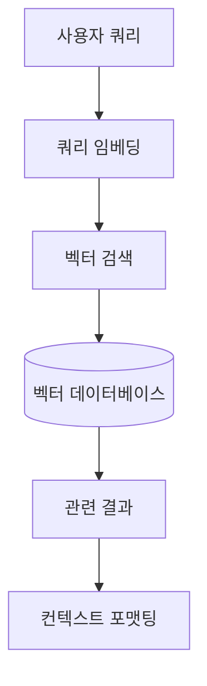

# 제품 컨텍스트

## 이 프로젝트가 존재하는 이유

MCP 코드베이스는 대규모 코드베이스를 효율적으로 탐색하고 이해할 수 있는 도구를 제공하기 위해 개발되었습니다. 개발자가 새로운 코드베이스에 빠르게 적응하고, 특정 기능이나 로직을 쉽게 찾을 수 있도록 지원합니다.

이 도구는 Claude AI 모델과 같은 강력한 LLM이 코드베이스를 더 잘 이해할 수 있는 컨텍스트를 제공함으로써, 개발자의 질문에 더 정확하고 유용한 답변을 생성할 수 있게 합니다.

## 해결하는 문제

1. **코드베이스 탐색 복잡성**

   - 대규모 코드베이스에서 특정 기능이나 로직 찾기 어려움
   - 코드 간 의존성 이해 난이도
   - 새로운 팀원의 온보딩 시간 단축 필요

2. **변경 관리 어려움**

   - 코드 변경에 따른 영향 분석 복잡성
   - Git 업데이트 후 관련 코드 재분석 필요
   - 불필요한 전체 재분석으로 인한 효율성 저하

3. **컨텍스트 제한**
   - LLM의 제한된 컨텍스트 윈도우
   - 관련성 높은 코드 선별 필요
   - 의미적 검색의 정확성 문제

## 작동 방식

MCP 코드베이스는 다음과 같은 핵심 워크플로우로 작동합니다:

### 프로젝트 생성 및 관리

### 코드 분석 및 청킹

### 검색 및 쿼리

## 사용자 경험 목표

1. **효율성**

   - 빠른 프로젝트 설정 및 분석
   - 변경된 파일만 선택적으로 재분석
   - 관련성 높은 코드 청크 신속 검색

2. **정확성**

   - 의미적으로 관련된 코드 청크 식별
   - 코드 간 관계 파악
   - 변경 사항 효과적 반영

3. **사용 편의성**
   - 직관적인 CLI 인터페이스
   - 명확한 도움말 및 오류 메시지
   - Git 저장소 자동 감지 및 통합

## CLI 인터페이스

MCP 코드베이스는 강력한 CLI 인터페이스를 제공하여 다음과 같은 작업을 수행할 수 있습니다:

1. **프로젝트 관리**

   - 프로젝트 생성: `create-project <name> <path> [options]`
   - 프로젝트 목록 조회: `list-projects`
   - 프로젝트 삭제: `delete-project <project_id>`

2. **코드 분석**

   - 프로젝트 분석: `analyze <project_id>`
   - 선택적 재분석: `analyze <project_id> --refresh`

3. **검색 기능**
   - 코드 검색: `search <project_id> <query>`
   - 고급 필터링: `search <project_id> <query> --filter <options>`

## 핵심 기능 역량

1. **지능형 코드 분석**

   - 다양한 프로그래밍 언어 지원
   - 구문 구조 및 의미 이해
   - 관련 코드 청크 그룹화

2. **효율적 변경 감지**

   - Git 커밋 해시 비교
   - 변경된 파일만 선택적 분석
   - 성능 및 리소스 사용 최적화

3. **의미적 검색**
   - 고품질 코드 임베딩
   - 코사인 유사도 기반 검색
   - 관련성 순위화
