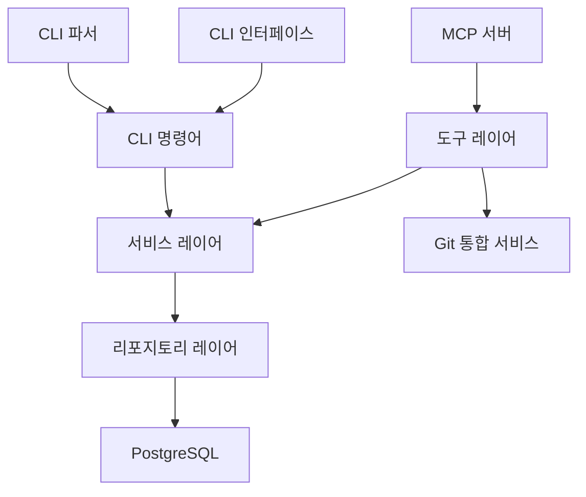

# 시스템 패턴

## 아키텍처 개요



## 주요 컴포넌트

1. **MCP 서버**

   - Model Context Protocol 구현
   - 도구 등록 및 실행 관리
   - 요청/응답 처리

2. **CLI 인터페이스**

   - 명령줄 인자 처리
   - 프로젝트 ID 및 옵션 관리
   - 서버/CLI 모드 전환
   - 명령어 파싱 및 실행

3. **도구 레이어**

   - 프로젝트 도구 (`projects.ts`)
   - 파일 도구 (`files.ts`)
   - 코드 도구 (`code.ts`)

4. **서비스 레이어**

   - 코드 청킹 서비스
   - 임베딩 서비스
   - Git 통합 서비스
   - 프로젝트 서비스

5. **리포지토리 레이어**
   - 코드 청크 리포지토리
   - 프로젝트 리포지토리

## 디자인 패턴

1. **리포지토리 패턴**

   - 데이터 액세스 로직 캡슐화
   - Drizzle ORM 활용
   - CRUD 작업 추상화

2. **서비스 패턴**

   - 비즈니스 로직 분리
   - 도구와 리포지토리 연결
   - 재사용 가능한 기능 모듈화

3. **도구 패턴**

   - MCP 도구 인터페이스 구현
   - 입력 스키마 정의
   - 실행 로직 캡슐화

4. **커맨드 패턴**

   - CLI 명령어 인터페이스 정의
   - 명령어 실행 로직 캡슐화
   - 인자 파싱 및 검증 분리

5. **싱글톤 패턴**
   - 서비스 인스턴스 공유
   - 리포지토리 인스턴스 공유
   - Git 서비스 단일 인스턴스 관리

## 데이터 흐름

```mermaid
sequenceDiagram
    참가자 MCP as MCP 클라이언트
    참가자 CLI as CLI 호출
    참가자 Server as MCP 서버
    참가자 Tool as 도구 레이어
    참가자 Service as 서비스 레이어
    참가자 Git as Git 통합
    참가자 Repository as 리포지토리
    참가자 DB as 데이터베이스

    CLI->>Server: 명령어 및 인자 전달

    alt CLI 명령어 모드
        Server->>CLI: CLI 파서로 명령어 처리
        CLI->>Service: 관련 서비스 직접 호출
    else MCP 모드
        MCP->>Server: 도구 실행 요청
        Server->>Tool: 도구 찾기 및 실행
    end

    Tool->>Service: 서비스 호출
    Service->>Git: 커밋 해시 확인
    Git-->>Service: 변경된 파일 목록

    alt 변경된 파일 있음
        Service->>Service: 변경된 파일만 선택적 처리
    end

    Service->>Repository: 데이터 조작
    Repository->>DB: 쿼리 실행
    DB-->>Repository: 결과 반환
    Repository-->>Service: 데이터 변환
    Service-->>Tool: 결과 처리

    alt MCP 모드
        Tool-->>Server: 응답 반환
        Server-->>MCP: 결과 전달
    else CLI 명령어 모드
        Service-->>CLI: 결과 반환
        CLI-->>Server: 실행 결과 출력
    end
```

## 코드 구조

```
src/
├── index.ts           # 서버 진입점
├── cli/               # CLI 인터페이스
│   └── index.ts       # 명령어 파서 및 실행기
├── tools/             # MCP 도구
│   ├── projects.ts    # 프로젝트 관리
│   ├── files.ts       # 파일 처리
│   └── code.ts        # 코드 분석
├── services/          # 비즈니스 로직
│   ├── codeChunkingService.ts
│   ├── embeddingService.ts
│   ├── fileSystem.ts
│   └── gitService.ts  # Git 통합 서비스
├── db/                # 데이터베이스
│   ├── index.ts       # DB 설정
│   └── schema.ts      # 스키마 정의
└── types/             # 타입 정의
    └── tool.ts        # 도구 타입
```

## 오류 처리

1. **계층별 오류 처리**

   - 데이터베이스 오류
   - 비즈니스 로직 오류
   - MCP 프로토콜 오류
   - Git 통합 오류
   - CLI 명령어 오류

2. **오류 전파**
   - 상세 오류 메시지
   - 스택 트레이스 보존
   - 적절한 오류 변환
   - 사용자 친화적 출력

## 확장성 고려사항

1. **새로운 명령어 추가**

   - CLI 명령어 인터페이스 구현
   - 서비스 로직 연결
   - 인자 파싱 정의

2. **데이터베이스 확장**

   - 새로운 테이블 추가
   - 인덱스 최적화
   - 마이그레이션 관리

3. **Git 통합 확장**
   - 다양한 Git 호스팅 지원
   - 브랜치/태그 관리
   - PR/커밋 기록 통합
