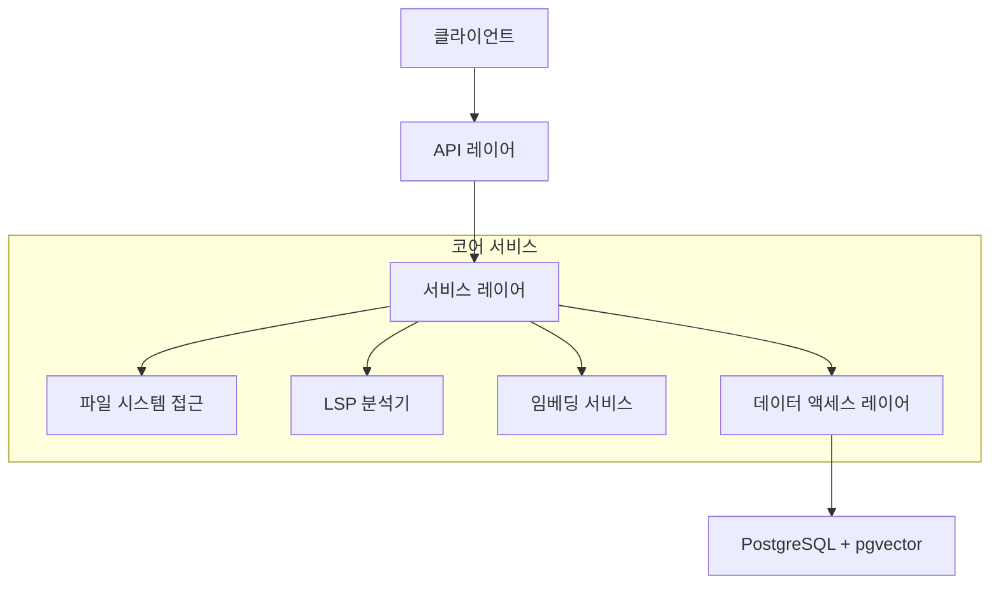
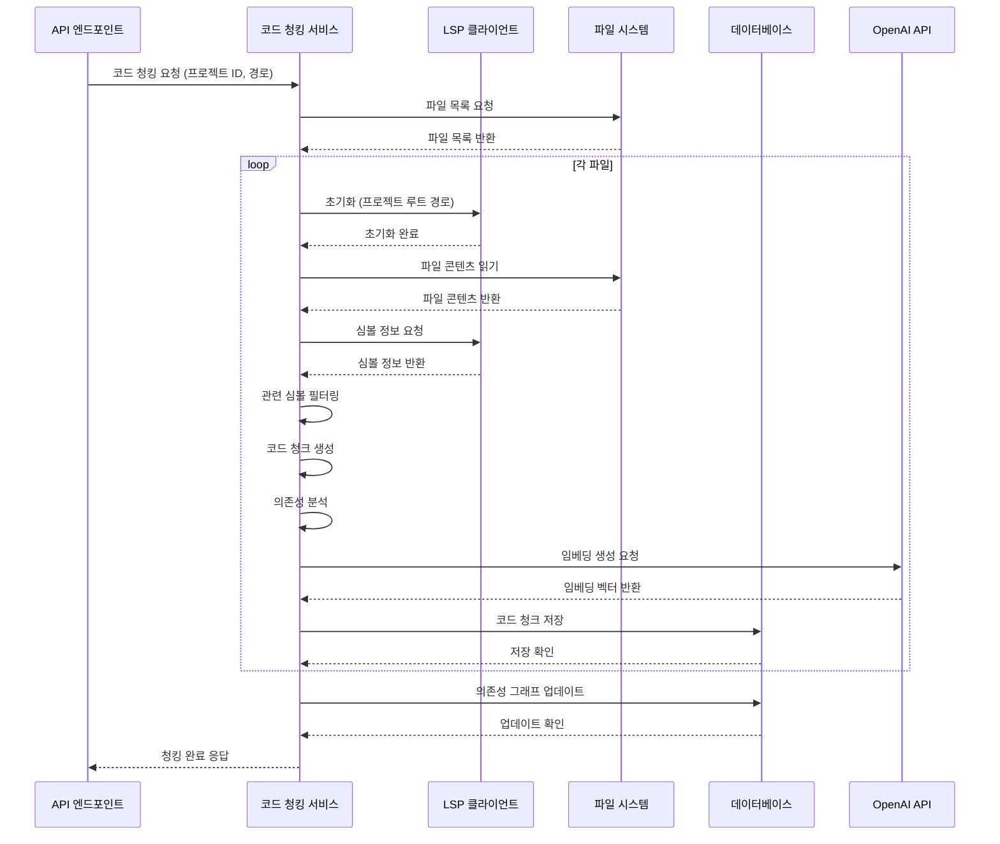
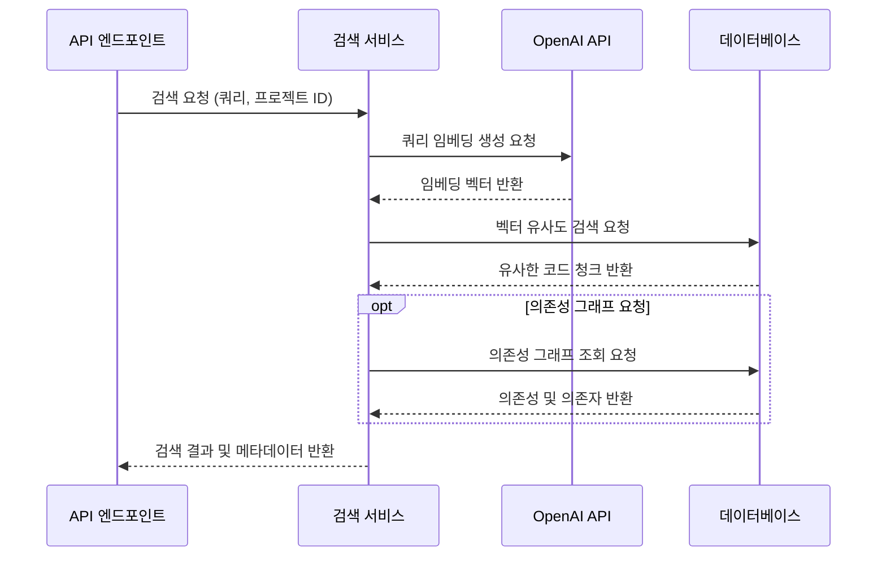
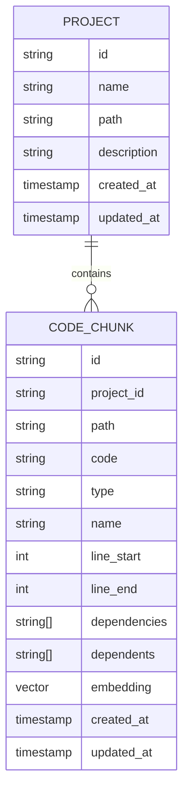

# 시스템 패턴

## 아키텍처 개요

MCP 서버는 모듈식 아키텍처를 채택하여 명확한 책임 분리와 확장성을 제공합니다. 전체 시스템은 여러 레이어로 구성되어 있으며, 각 레이어는 특정 문제 도메인을 담당합니다.



## 주요 컴포넌트

### 1. API 레이어 (Hono)

- REST API 엔드포인트 제공
- 요청 유효성 검사
- 응답 형식화
- 에러 처리

### 2. 서비스 레이어

- 비즈니스 로직 처리
- 의존성 주입 패턴
- 인터페이스 기반 설계

### 3. 파일 시스템 접근

- 프로젝트 파일 탐색
- 파일 내용 읽기
- 경로 보안 검증

### 4. LSP 분석기

- TypeScript 코드 구조 분석
- 심볼 추출 및 필터링
- 코드 의존성 그래프 생성

### 5. 임베딩 서비스

- OpenAI API 연동
- 코드 청크 벡터화
- 쿼리 텍스트 벡터화

### 6. 데이터 액세스 레이어

- Drizzle ORM 사용
- 타입 안전한 SQL 쿼리 구성
- 프로젝트별 필터링 지원

### 7. 데이터베이스

- PostgreSQL + pgvector
- 코드 청크 및 메타데이터 저장
- 벡터 유사도 검색

## 주요 디자인 패턴

### 의존성 주입 패턴

```typescript
// 서비스 클래스 예시
export class CodeChunkService {
  constructor(
    private symbolExtractor: SymbolExtractor,
    private codeChunkRepository: CodeChunkRepository,
    private embeddingService: EmbeddingService
  ) {}

  // 메서드...
}

// 의존성 주입 예시
const lspClient = new LspClient();
const symbolExtractor = new SymbolExtractor(lspClient);
const codeChunkRepository = new CodeChunkRepository(db);
const embeddingService = new EmbeddingService(process.env.OPENAI_API_KEY!);

const codeChunkService = new CodeChunkService(
  symbolExtractor,
  codeChunkRepository,
  embeddingService
);
```

### 리포지토리 패턴

```typescript
// 코드 청크 리포지토리 예시
export class CodeChunkRepository {
  constructor(private db: PostgresDatabase) {}

  async findById(id: string): Promise<CodeChunk | null> {
    // 구현...
  }

  async findByProjectId(projectId: string): Promise<CodeChunk[]> {
    // 구현...
  }

  async findSimilar(
    embedding: number[],
    options: { projectId?: string; limit?: number }
  ): Promise<SearchResult[]> {
    // 구현...
  }

  // 기타 메서드...
}
```

### 서비스 인터페이스 패턴

```typescript
export interface IFileSystemService {
  listFiles(projectId: string, path: string): Promise<FileInfo[]>;
  readFile(projectId: string, path: string): Promise<string>;
}

export class FileSystemService implements IFileSystemService {
  constructor(private projectRepository: ProjectRepository) {}

  async listFiles(projectId: string, path: string): Promise<FileInfo[]> {
    // 구현...
  }

  async readFile(projectId: string, path: string): Promise<string> {
    // 구현...
  }
}
```

## LSP 통합 흐름

LSP(Language Server Protocol)를 사용하여 코드베이스에서 구조적 정보를 추출하고 코드 청크를 생성하는 전체 과정입니다.



## 코드 검색 흐름

사용자 쿼리를 기반으로 유사한 코드 청크를 검색하고 반환하는 과정입니다.



## 프로젝트 관리 패턴

각 프로젝트는 독립적인 단위로 관리되며, 코드 청크는 항상 특정 프로젝트에 속합니다.



## 데이터 모델 관계

### 프로젝트 모델

```typescript
// projects.ts
export interface Project {
  id: string;
  name: string;
  path: string;
  description?: string;
  createdAt: Date;
  updatedAt: Date;
}
```

### 코드 청크 모델

```typescript
// codeChunks.ts
export interface CodeChunk {
  id: string;
  projectId: string;
  path: string;
  code: string;
  type: "function" | "class" | "type";
  name: string;
  lineStart: number;
  lineEnd: number;
  dependencies: string[];
  dependents: string[];
  embedding?: number[];
  createdAt?: Date;
  updatedAt?: Date;
}
```

## 컴포넌트 간 인터페이스

### CodeChunkRepository 인터페이스

```typescript
export interface ICodeChunkRepository {
  findById(id: string): Promise<CodeChunk | null>;
  findByProjectId(projectId: string): Promise<CodeChunk[]>;
  findByNames(names: string[], projectId: string): Promise<CodeChunk[]>;
  findSimilar(
    embedding: number[],
    options: { projectId?: string; limit?: number }
  ): Promise<SearchResult[]>;
  insertMany(codeChunks: CodeChunk[]): Promise<void>;
  update(id: string, updates: Partial<CodeChunk>): Promise<void>;
  deleteByProjectId(projectId: string): Promise<void>;
}
```

### SymbolExtractor 인터페이스

```typescript
export interface ISymbolExtractor {
  extractSymbols(filePath: string): Promise<DocumentSymbol[]>;
  filterRelevantSymbols(symbols: DocumentSymbol[]): DocumentSymbol[];
  mapSymbolKindToChunkType(
    kind: SymbolKind
  ): "function" | "class" | "type" | null;
}
```

### EmbeddingService 인터페이스

```typescript
export interface IEmbeddingService {
  generateEmbedding(text: string): Promise<number[]>;
  generateQueryEmbedding(query: string): Promise<number[]>;
}
```

## 핵심 워크플로우

### 코드 청크 생성 워크플로우

1. 프로젝트 경로에서 모든 코드 파일 스캔
2. 각 파일에 대해 LSP 서버에 심볼 정보 요청
3. 심볼 정보를 기반으로 코드 청크 생성
4. 코드 청크에서 의존성 관계 분석
5. 각 코드 청크에 대한 임베딩 생성
6. 코드 청크 및 임베딩을 데이터베이스에 저장
7. 의존성 그래프 업데이트

### 코드 검색 워크플로우

1. 사용자 쿼리 수신 (및 선택적 프로젝트 ID)
2. 쿼리 텍스트에 대한 임베딩 생성
3. 벡터 유사도 검색 수행 (프로젝트별 필터링 포함)
4. 관련 코드 청크 및 유사도 점수 반환
5. 요청 시 추가 메타데이터 (예: 의존성 그래프) 포함

## 코드 분석 패턴

### AST 기반 코드 분석

```typescript
class AstAnalyzer {
  private program: ts.Program;
  private typeChecker: ts.TypeChecker;

  analyzeNode(node: ts.Node): void {
    // AST 노드 분석
    if (ts.isFunctionDeclaration(node)) {
      // 함수 선언 처리
    } else if (ts.isClassDeclaration(node)) {
      // 클래스 선언 처리
    } else if (ts.isInterfaceDeclaration(node)) {
      // 인터페이스 선언 처리
    }

    // 재귀적으로 자식 노드 방문
    ts.forEachChild(node, (child) => this.analyzeNode(child));
  }
}
```

### 타입 체커 활용

```typescript
class TypeChecker {
  private typeChecker: ts.TypeChecker;

  getSymbolInfo(node: ts.Node): ts.Symbol | undefined {
    return this.typeChecker.getSymbolAtLocation(node);
  }

  getTypeInfo(node: ts.Node): ts.Type {
    return this.typeChecker.getTypeAtLocation(node);
  }
}
```

### 의존성 분석

```typescript
class DependencyAnalyzer {
  private typeChecker: ts.TypeChecker;

  analyzeDependencies(node: ts.Node): string[] {
    const dependencies = new Set<string>();

    // 식별자 처리
    if (ts.isIdentifier(node)) {
      const symbol = this.typeChecker.getSymbolAtLocation(node);
      if (symbol?.declarations?.[0]) {
        dependencies.add(symbol.getName());
      }
    }

    // 타입 참조 처리
    if (ts.isTypeReferenceNode(node)) {
      const type = this.typeChecker.getTypeFromTypeNode(node);
      const symbol = type.getSymbol();
      if (symbol) {
        dependencies.add(symbol.getName());
      }
    }

    return Array.from(dependencies);
  }
}
```

## 코드 청크 패턴

### 청크 추출기

```typescript
interface CodeChunkExtractor {
  extractFromNode(node: ts.Node): CodeChunk | null;
  processChunk(chunk: CodeChunk): void;
  generateEmbedding(chunk: CodeChunk): Promise<void>;
}
```

### 청크 프로세서

```typescript
class ChunkProcessor {
  private batchSize: number = 300;

  async processBatch(chunks: CodeChunk[]): Promise<void> {
    const batches = this.createBatches(chunks);
    await Promise.all(batches.map(this.processBatchItem));
  }

  private createBatches(chunks: CodeChunk[]): CodeChunk[][] {
    return chunks.reduce((acc, chunk, i) => {
      const batchIndex = Math.floor(i / this.batchSize);
      if (!acc[batchIndex]) acc[batchIndex] = [];
      acc[batchIndex].push(chunk);
      return acc;
    }, [] as CodeChunk[][]);
  }
}
```

## 임베딩 패턴

### 임베딩 생성기

```typescript
interface EmbeddingGenerator {
  preprocessCode(code: string, filePath?: string): string;
  generateBatch(texts: string[]): Promise<number[][]>;
  handleError(error: Error): void;
}
```

### 임베딩 프로세서

```typescript
class EmbeddingProcessor {
  async processBatch(texts: string[]): Promise<number[][]> {
    try {
      const preprocessed = texts.map(this.preprocess);
      const embeddings = await this.generateEmbeddings(preprocessed);
      return embeddings;
    } catch (error) {
      this.handleError(error);
      throw error;
    }
  }
}
```

## 에러 처리 패턴

### AST 분석 에러

```typescript
class AstError extends Error {
  constructor(
    public readonly node: ts.Node,
    public readonly phase: string,
    message: string
  ) {
    super(message);
  }
}
```

### 임베딩 에러

```typescript
class EmbeddingError extends Error {
  constructor(
    public readonly input: string,
    public readonly phase: string,
    message: string
  ) {
    super(message);
  }
}
```

## 배치 처리 패턴

### 병렬 처리

```typescript
class ParallelProcessor {
  async processItems<T, R>(
    items: T[],
    processor: (item: T) => Promise<R>,
    batchSize: number
  ): Promise<R[]> {
    const batches = this.createBatches(items, batchSize);
    const results = await Promise.all(
      batches.map((batch) => Promise.all(batch.map(processor)))
    );
    return results.flat();
  }
}
```

### 에러 복구

```typescript
class ErrorRecovery {
  async processWithRecovery<T>(
    processor: () => Promise<T>,
    maxRetries: number = 3
  ): Promise<T> {
    let lastError: Error | null = null;

    for (let i = 0; i < maxRetries; i++) {
      try {
        return await processor();
      } catch (error) {
        lastError = error;
        await this.wait(Math.pow(2, i) * 1000);
      }
    }

    throw lastError;
  }
}
```

## 모니터링 패턴

### 성능 추적

```typescript
class PerformanceTracker {
  private metrics: Map<string, number> = new Map();

  trackOperation(name: string, duration: number): void {
    const current = this.metrics.get(name) || 0;
    this.metrics.set(name, current + duration);
  }

  getMetrics(): Record<string, number> {
    return Object.fromEntries(this.metrics);
  }
}
```

### 리소스 모니터링

```typescript
class ResourceMonitor {
  private memoryUsage: number[] = [];

  trackMemory(): void {
    this.memoryUsage.push(process.memoryUsage().heapUsed);
  }

  getAverageMemory(): number {
    return (
      this.memoryUsage.reduce((a, b) => a + b, 0) / this.memoryUsage.length
    );
  }
}
```
