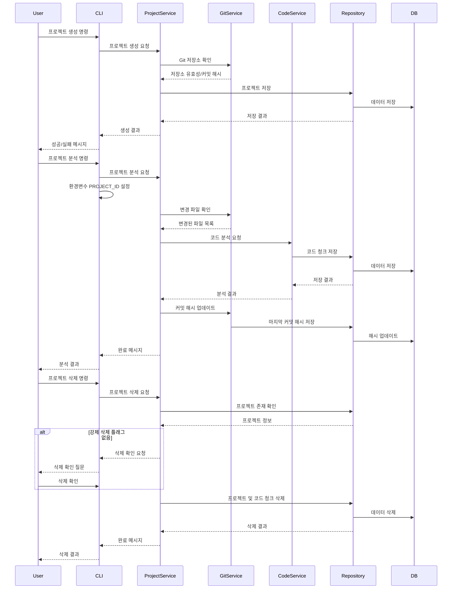

# 시스템 패턴

## 아키텍처 개요

MCP 코드베이스는 다음과 같은 아키텍처를 사용합니다:


### 핵심 컴포넌트

1. **CLI 인터페이스**

   - 명령어 파싱 및 실행
   - 프로젝트 관리 명령어 처리
   - 사용자 입력 검증
   - 도움말 및 예제 제공

2. **MCP 서버**

   - stdio 기반 통신
   - 도구 호출 핸들링
   - 에러 관리

3. **서비스 계층**

   - 비즈니스 로직 처리
   - Git 통합 관리
   - 프로젝트 및 코드 관리 서비스
   - 임베딩 생성 서비스

4. **도구 계층**

   - 파일 처리 도구
   - 코드 분석 도구
   - 사용자에게 노출되는 인터페이스

5. **리포지토리 계층**

   - 데이터 액세스 로직
   - ORM 관리
   - 벡터 검색 처리

6. **데이터베이스**
   - PostgreSQL + pgvector
   - 코드 청크 및 임베딩 저장
   - 프로젝트 메타데이터 관리

## 주요 설계 패턴

1. **계층형 아키텍처**

   - 관심사 분리를 통한 코드 구조화
   - 계층 간 명확한 의존성 방향
   - 상위 계층에서 하위 계층으로의 의존성만 허용

2. **리포지토리 패턴**

   - 데이터 액세스 로직 추상화
   - 데이터베이스 독립적인 인터페이스 제공
   - `codeChunkRepository.ts` 및 관련 클래스에 구현

3. **서비스 패턴**

   - 비즈니스 로직 캡슐화
   - 컨트롤러/도구와 리포지토리 사이의 중개자
   - 재사용 가능한 기능 제공
   - 프로젝트 관리 서비스로 도구 기능 이전

4. **도구 패턴**

   - MCP 통합을 위한 표준 인터페이스
   - 입출력 형식 일관성 유지
   - 사용자와의 상호작용 담당
   - 비즈니스 로직 최소화

5. **명령 패턴**
   - CLI 명령어 처리를 위한 구조
   - 명령어를 객체로 캡슐화
   - 실행 및 검증 로직 분리

## 주요 기술적 결정

1. **환경변수 기반 구성**

   - 프로젝트 ID를 환경변수 `PROJECT_ID`로 전달
   - 명령줄 인자 대신 환경변수 사용으로 일관성 확보
   - CLI와 MCP 서버 모드 간 통일된 접근 방식

2. **프로젝트 관리 분리**

   - 프로젝트 관리 기능을 MCP 도구에서 제거
   - `projectService`를 통한 중앙화된 프로젝트 관리
   - CLI를 통해서만 프로젝트 관리 기능 노출
   - Git 저장소 필수 요구사항 적용

3. **데이터 삭제 전략**
   - 프로젝트 삭제 시 관련 코드 청크 캐스케이드 삭제
   - 무분별한 삭제 방지를 위한 확인 절차 구현
   - 트랜잭션 기반 실행으로 데이터 일관성 보장

## 데이터 흐름

프로젝트 관리 및 코드 분석의 주요 데이터 흐름:



## 오류 처리 전략

1. **정형화된 오류 객체**

   - 일관된 오류 형식 사용
   - 코드, 메시지, 상세 정보 포함
   - 계층별 오류 타입 정의

2. **오류 전파**

   - 하위 계층에서 발생한 오류 포착 및 변환
   - 컨텍스트 정보 추가
   - 적절한 로깅

3. **사용자 친화적 오류**
   - CLI에서 오류 메시지 포맷팅
   - 문제 해결 제안 포함
   - 디버깅 정보 제공(개발 모드)

## 모듈 구조

```
src/
├── cli/
│   └── index.ts             # CLI 명령어 파서 및 실행기
├── db/
│   ├── index.ts             # 데이터베이스 연결 관리
│   └── schema.ts            # 테이블 스키마 정의
├── services/
│   ├── projectService.ts    # 프로젝트 관리 서비스
│   ├── gitService.ts        # Git 통합 서비스
│   ├── codeService.ts       # 코드 분석 서비스
│   └── embeddingService.ts  # 임베딩 생성 서비스
├── repositories/
│   └── codeChunkRepository.ts  # 코드 청크 리포지토리
├── tools/
│   ├── code.ts              # 코드 분석 도구
│   └── files.ts             # 파일 처리 도구
├── types/
│   ├── index.ts             # 공통 타입 정의
│   └── tool.ts              # 도구 관련 타입
└── index.ts                 # 애플리케이션 진입점
```

## 주요 클래스 및 인터페이스

### 서비스 계층

```typescript
// ProjectService
interface ProjectService {
  createProject(params: CreateProjectParams): Promise<Project>;
  listProjects(): Promise<Project[]>;
  analyzeProject(
    projectId: string,
    forceRefresh?: boolean
  ): Promise<AnalysisResult>;
  updateProjectCommitHash(projectId: string, hash: string): Promise<void>;
  deleteProject(projectId: string): Promise<boolean>;
}

// GitService
interface GitService {
  isGitRepository(path: string): Promise<boolean>;
  getCurrentCommitHash(path: string): Promise<string>;
  getChangedFiles(path: string, since: string): Promise<string[]>;
  updateLastAnalyzedCommit(projectId: string, hash: string): Promise<void>;
}
```

### 리포지토리 계층

```typescript
interface CodeChunkRepository {
  createProject(project: Project): Promise<Project>;
  getProjectById(id: string): Promise<Project | null>;
  getAllProjects(): Promise<Project[]>;
  saveCodeChunk(chunk: CodeChunk): Promise<void>;
  searchCodeChunks(query: string, projectId: string): Promise<CodeChunk[]>;
  updateProjectCommitHash(projectId: string, hash: string): Promise<void>;
  deleteProject(projectId: string): Promise<boolean>;
  getProjectChunkCount(projectId: string): Promise<number>;
}
```

### CLI 명령 처리

```typescript
interface Command {
  name: string;
  description: string;
  execute(args: string[]): Promise<void>;
}

interface ParseOptions {
  requiredArgs?: string[];
  optionalArgs?: string[];
  flags?: string[];
  namedArgs?: string[];
  descriptions?: Record<string, string>;
  examples?: string[];
}

interface ParsedArgs {
  positional: string[];
  named: Record<string, string>;
  flags: Record<string, boolean>;
}
```
