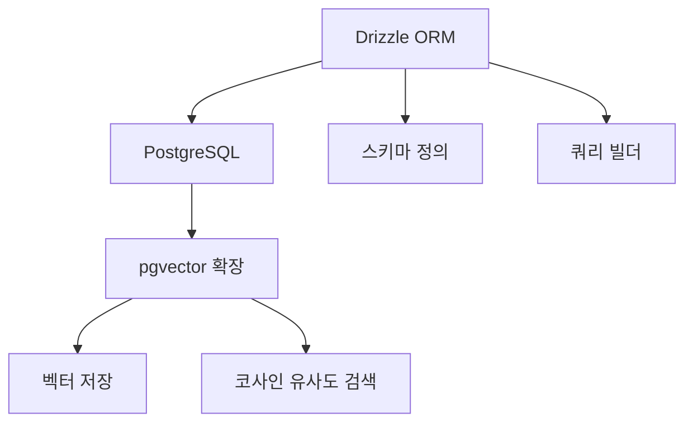
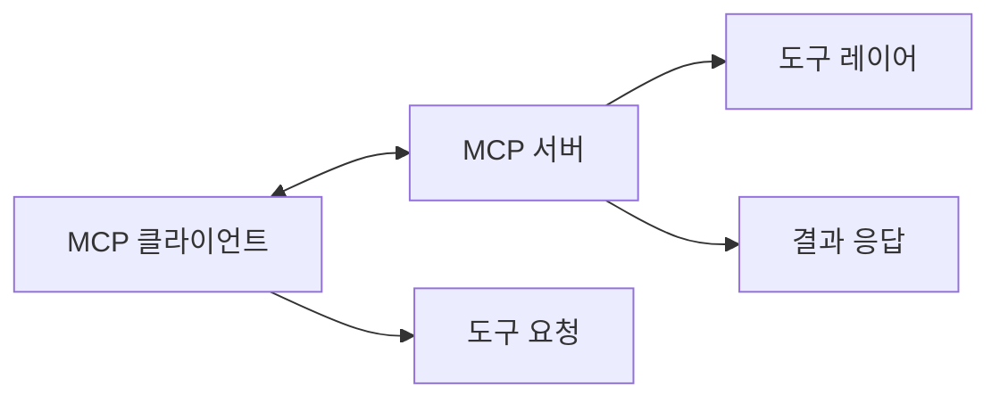
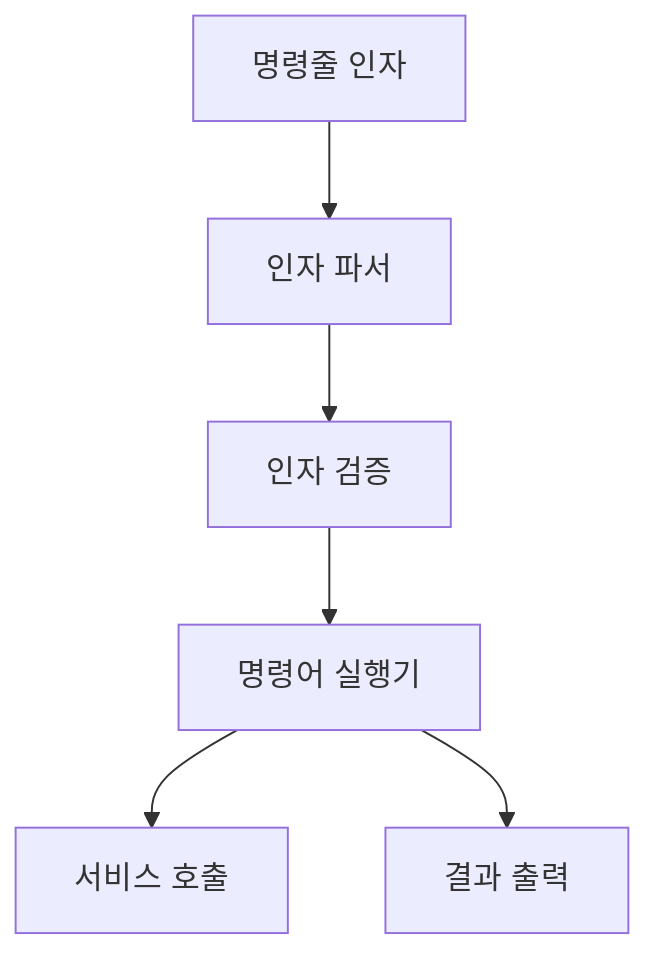
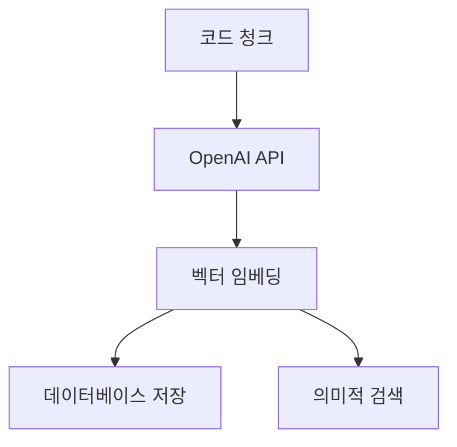
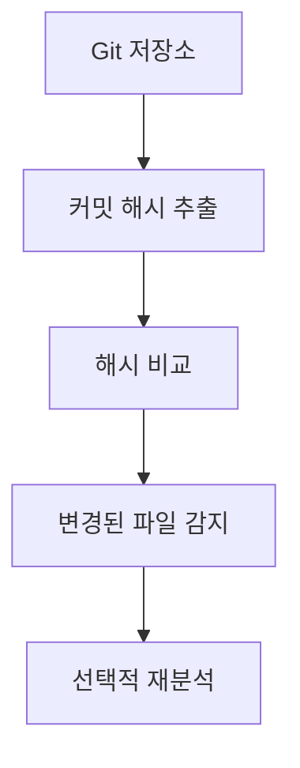

# 기술 컨텍스트

## 사용 기술

### 백엔드

1. **런타임 및 언어**:

   - Bun 런타임
   - TypeScript

2. **데이터베이스**:

   - PostgreSQL
   - pgvector 확장 (벡터 유사도 검색)
   - Drizzle ORM

3. **프로토콜**:

   - Model Context Protocol (MCP)
   - Node.js `stdio`를 통한 전송 계층

4. **임베딩**:

   - OpenAI API (코드 임베딩 생성)
   - 코사인 유사도 기반 검색

5. **코드 분석**:

   - 정규 표현식 기반 파싱
   - 구문 트리 분석
   - 의존성 추출

6. **버전 관리**:

   - Git 통합
   - 커밋 해시 추적
   - 변경 파일 감지

7. **CLI 인터페이스**:
   - 커맨드 라인 인자 파싱
   - 명령어 기반 아키텍처
   - 도움말 및 사용법 생성

## 기술 스택 상세

### Bun + TypeScript


- **버전**: Bun 1.x
- **주요 기능**:
  - 빠른 실행 시간
  - 내장 번들러
  - TypeScript 지원
  - 패키지 관리

### PostgreSQL + pgvector



- **버전**: PostgreSQL 15+
- **pgvector**: 고차원 벡터 저장 및 유사도 검색
- **Drizzle ORM**: 타입 안전한 데이터베이스 액세스
- **스키마 확장**: Git 커밋 해시 저장 필드 추가

### MCP (Model Context Protocol)



- **주요 개념**:
  - 도구 정의 및 실행
  - 요청/응답 처리
  - 표준화된 통신

### CLI 인터페이스



- **주요 기능**:
  - 명령어 기반 구조
  - 인자 파싱 및 검증
  - 도움말 생성
  - 오류 처리

### OpenAI 임베딩



- **모델**: text-embedding-3-large
- **차원**: 1536
- **용도**: 코드 의미 분석 및 유사도 검색

### Git 통합



- **주요 기능**:
  - 로컬 Git 저장소 통합
  - 변경 파일 추적 기능
  - 프로젝트별 최신 커밋 저장
  - 변경된 파일 필터링

## 개발 환경

### 개발 도구

- **IDE**: VS Code
- **패키지 관리자**: Bun
- **버전 관리**: Git
- **CI/CD**: 미구현 상태

### 환경 설정

1. **환경 변수**:

   - `DATABASE_URL`: PostgreSQL 연결 문자열
   - `OPENAI_API_KEY`: OpenAI API 키
   - `PROJECT_ID`: 현재 작업 중인 프로젝트 ID

2. **필수 설치**:
   - Bun 런타임
   - PostgreSQL 15+ (pgvector 확장 포함)
   - Git

## 데이터 흐름

### CLI 명령어 실행 프로세스

```mermaid
sequenceDiagram
    참가자 User as 사용자
    참가자 CLI as CLI 인터페이스
    참가자 Parser as 인자 파서
    참가자 Command as 명령어
    참가자 Service as 서비스
    참가자 Repository as 저장소
    참가자 DB as 데이터베이스

    User->>CLI: 명령어 실행
    CLI->>Parser: 인자 전달
    Parser->>Parser: 인자 파싱 및 검증

    alt 검증 실패
        Parser-->>CLI: 오류 반환
        CLI-->>User: 오류 메시지 및 사용법 표시
    else 검증 성공
        Parser->>Command: 명령어 및 검증된 인자 전달
        Command->>Service: 서비스 호출
        Service->>Repository: 저장소 작업
        Repository->>DB: 데이터베이스 쿼리
        DB-->>Repository: 결과 반환
        Repository-->>Service: 데이터 변환
        Service-->>Command: 결과 전달
        Command-->>CLI: 처리 결과 반환
        CLI-->>User: 결과 출력
    end
```

### 코드 청킹 프로세스

```mermaid
sequenceDiagram
    참가자 Tool as 분석 도구
    참가자 FS as 파일 시스템
    참가자 Chunking as 청킹 서비스
    참가자 Git as Git 서비스
    참가자 Embedding as 임베딩 서비스
    참가자 DB as 데이터베이스

    Tool->>Git: 커밋 해시 확인
    Git-->>Tool: 마지막 분석 이후 변경 여부

    alt 변경된 파일 있음
        Git->>Git: 변경된 파일 목록 추출
        Git-->>Tool: 변경된 파일 목록
        Tool->>Chunking: 변경된 파일만 처리
    else 변경 없음 또는 첫 분석
        Tool->>FS: 전체 파일 접근
        FS-->>Tool: 모든 파일 내용
        Tool->>Chunking: 전체 파일 처리
    end

    Chunking->>Chunking: 코드 파싱 및 분석
    Chunking-->>Tool: 추출된 청크

    Tool->>Embedding: 벡터 생성 요청
    Embedding-->>Tool: 임베딩 벡터

    Tool->>DB: 청크 및 벡터 저장
    DB-->>Tool: 저장 결과

    Tool->>Git: 현재 커밋 해시 저장
    Git-->>Tool: 저장 완료
```

### 검색 프로세스

```mermaid
sequenceDiagram
    참가자 Client as 클라이언트
    참가자 Tool as 검색 도구
    참가자 Git as Git 서비스
    참가자 Embedding as 임베딩 서비스
    참가자 DB as 데이터베이스

    Client->>Tool: 검색 쿼리
    Tool->>Git: 커밋 해시 확인

    alt 변경된 파일 있음
        Git-->>Tool: 변경 감지됨
        Tool->>Tool: 변경 파일 재분석
    else 변경 없음
        Git-->>Tool: 변경 없음
    end

    Tool->>Embedding: 쿼리 임베딩 생성
    Embedding-->>Tool: 쿼리 벡터

    Tool->>DB: 코사인 유사도 검색
    DB-->>Tool: 유사 청크

    Tool->>Client: 검색 결과
```

## 기술적 제약 사항

1. **벡터 검색 제한**:

   - pgvector 성능 제약
   - 대규모 벡터 컬렉션 처리 한계
   - 일부 복잡한 유사도 쿼리 제한

2. **코드 분석 제한**:

   - 정규식 기반 파싱의 한계
   - 일부 복잡한 코드 패턴 분석 어려움
   - 다양한 프로그래밍 언어 지원 제한

3. **확장성 제약**:

   - 단일 서버 아키텍처
   - 병렬 처리 제한
   - 메모리 사용량 최적화 필요

4. **Git 통합 제약**:
   - 로컬 Git 저장소만 지원
   - 복잡한 Git 워크플로우 미지원
   - 대규모 저장소 처리 성능 한계

## 의존성

1. **직접 의존성**:

   - `@modelcontextprotocol/sdk`: MCP 프로토콜 구현
   - `drizzle-orm`: 데이터베이스 ORM
   - `pg`: PostgreSQL 클라이언트
   - `openai`: OpenAI API 클라이언트
   - `child_process`: Git 명령어 실행

2. **개발 의존성**:
   - `typescript`: 타입 시스템
   - `bun-types`: Bun 타입 정의
   - `drizzle-kit`: 마이그레이션 도구
